<h1 align="center" style="border-bottom: none">
    <b>
        <a href="https://www.nocodb.com">NocoDB </a><br>
    </b>
    ✨ The Open Source Airtable Alternative ✨ <br>

</h1>
<p align="center">
Turns any MySQL, PostgreSQL, SQL Server, SQLite & MariaDB into a smart-spreadsheet. 
</p>
<div align="center">
 
[](https://travis-ci.com/github/NocoDB/NocoDB) 
[](http://nodejs.org/download/)
[](https://twitter.com/NocoDB)

</div>

<p align="center">
    <a href="http://www.nocodb.com"><b>Website</b></a> •
    <a href="https://discord.gg/5RgZmkW"><b>Discord</b></a> • 
    <a href="https://twitter.com/nocodb"><b>Twitter</b></a>
</p>  

<p align="center">
    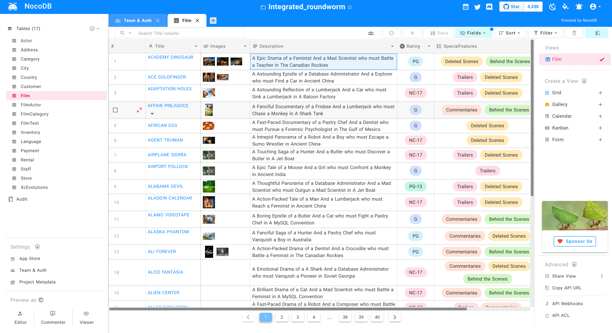
    <br/><br/>
</p>

<a href="https://www.producthunt.com/posts/nocodb?utm_source=badge-featured&utm_medium=badge&utm_souce=badge-nocodb" target="_blank"></a>

# Quick try
### 1-Click Deploy

#### Heroku
<a href="https://heroku.com/deploy?template=https://github.com/npgia/nocodb-seed-heroku">
    
</a>
<br>

### Using Docker
```bash
docker run -d --name nocodb -p 8080:8080 nocodb/nocodb
```

### Using Npm
```
npx create-nocodb-app
```
### Using Git
```
git clone https://github.com/nocodb/nocodb-seed
cd nocodb-seed
npm install
npm start
```

### GUI

Access Dashboard using : [http://localhost:8080/dashboard](http://localhost:8080/dashboard)


# Join Our Community
<a href="https://discord.gg/5RgZmkW">
    
</a>
<br>

# Screenshots
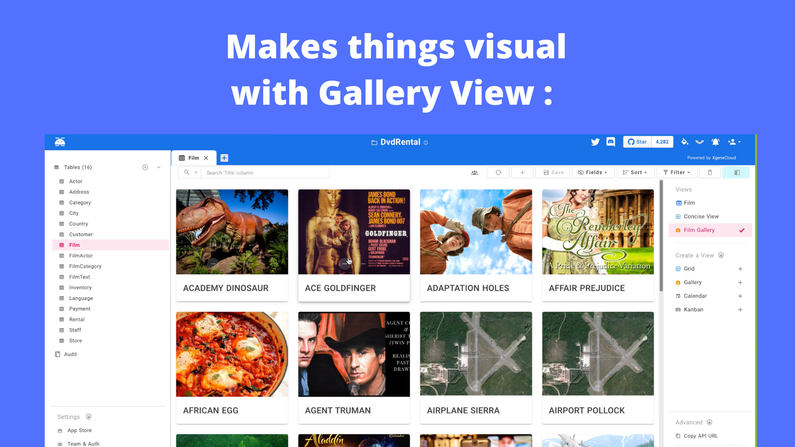
<br>
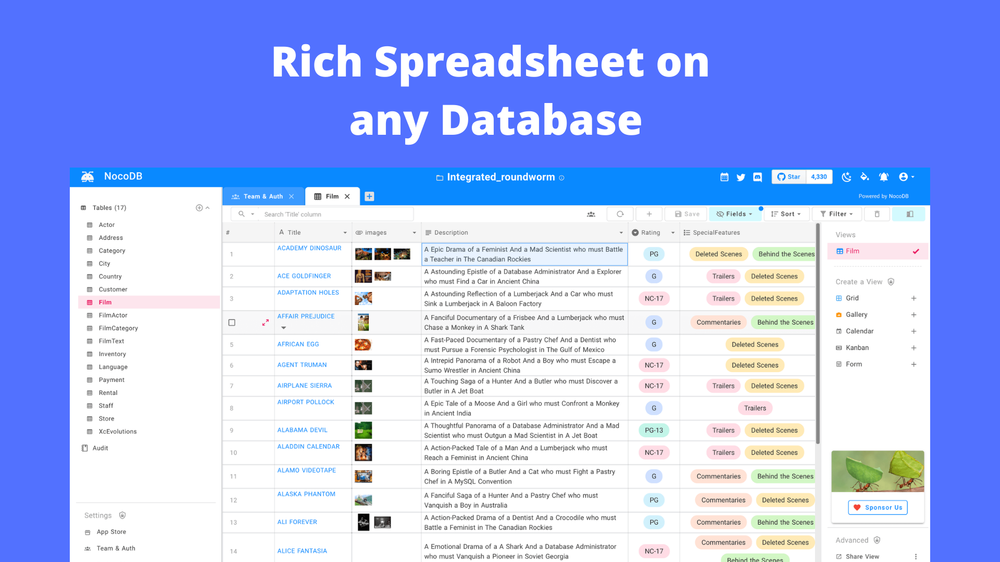
<br>
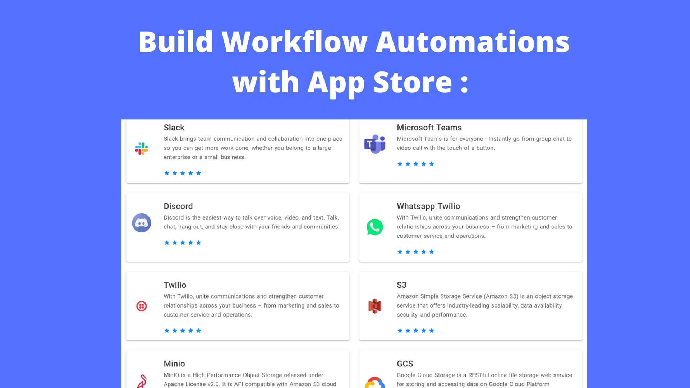
<br>
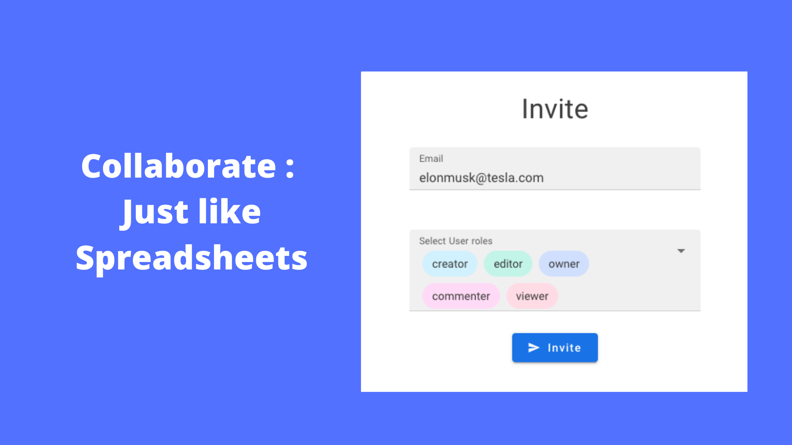
<br>
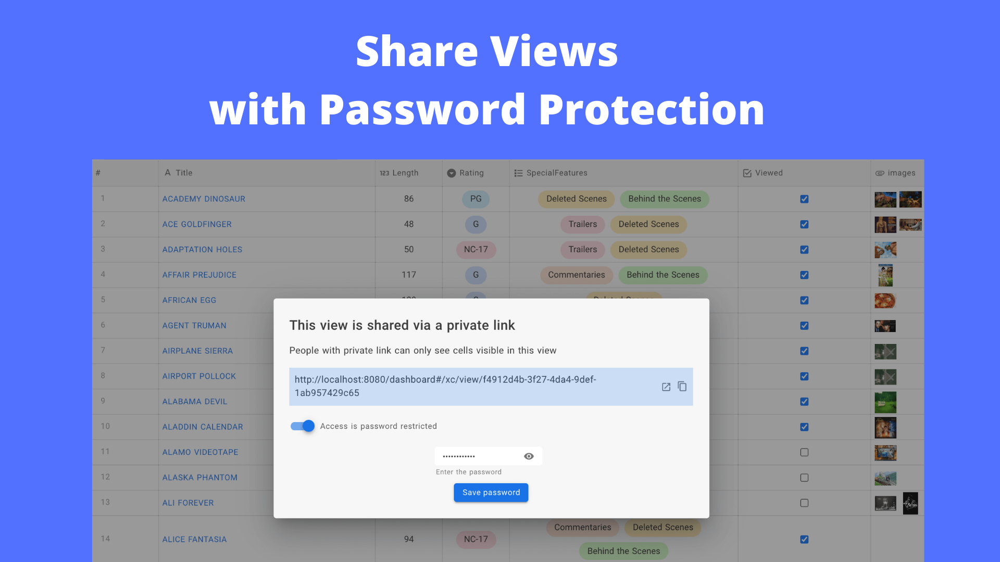
<br>
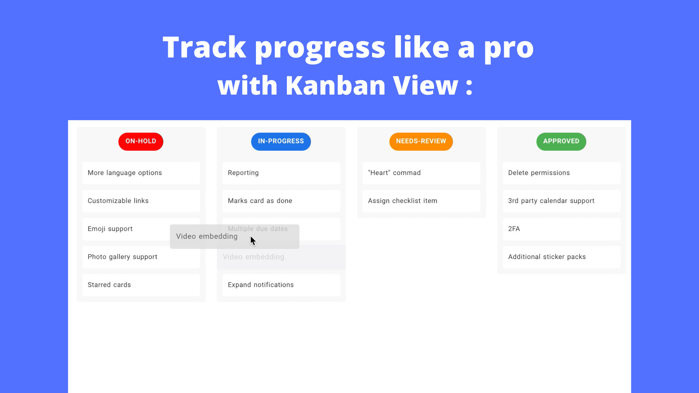
<br>
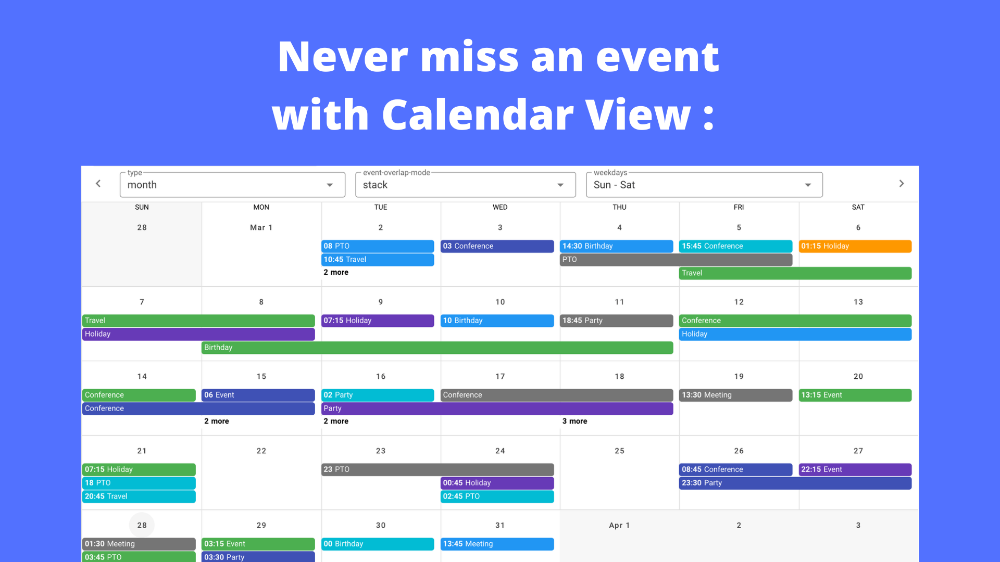
<br>

<br>
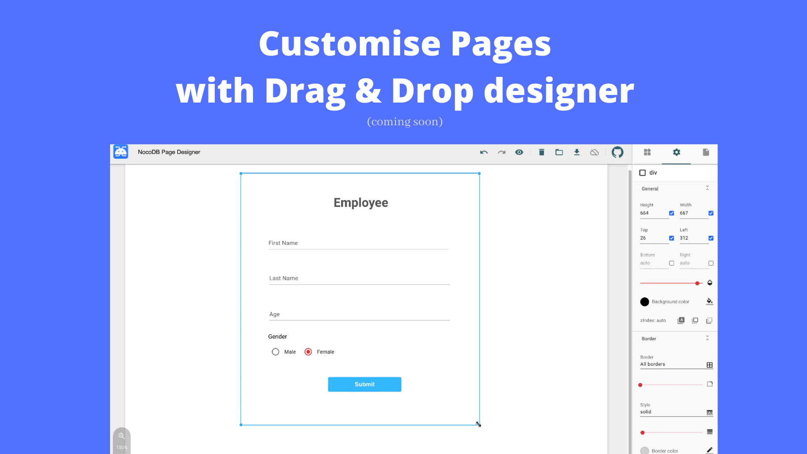
<br>
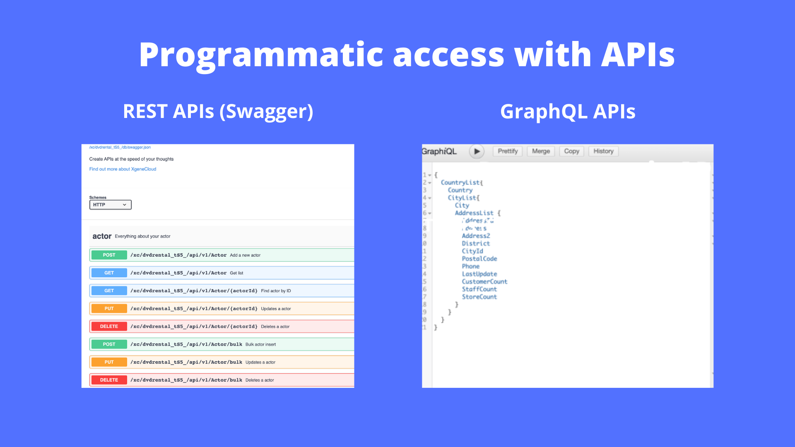
<br>
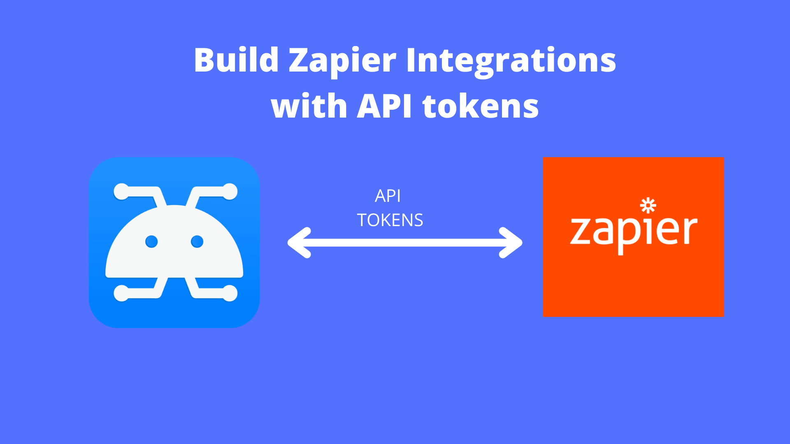
<br>


# Features
### Rich Spreadsheet Interface
- ⚡ &nbsp;Search, sort, filter, hide columns with uber ease
- ⚡ &nbsp;Create Views : Grid, Gallery, Kanban, Gantt, Form
- ⚡ &nbsp;Share Views : public & password protected
- ⚡ &nbsp;Personal & locked Views 
- ⚡ &nbsp;Upload images to cells (Works with S3, Minio, GCP, Azure, DigitalOcean, Linode, OVH, BackBlaze)!!
- ⚡ &nbsp;Roles : Owner, Creator, Editor, Commenter, Viewer, Commenter, Custom Roles.
- ⚡ &nbsp;Access Control : Fine-grained access control even at database, table & column level.

### App Store for workflow automations :
- ⚡ &nbsp;Chat : Microsoft Teams, Slack, Discord, Mattermost
- ⚡ &nbsp;Email : SMTP, SES, Mailchimp
- ⚡ &nbsp;SMS : Twilio
- ⚡ &nbsp;Whatsapp
- ⚡ &nbsp;Any 3rd Party APIs

### Programmatic API access via :
- ⚡ &nbsp;REST APIs (Swagger) 
- ⚡ &nbsp;GraphQL APIs.
- ⚡ &nbsp;Includes JWT Authentication & Social Auth
- ⚡ &nbsp;API tokens to integrate with Zapier, Integromat.

# Production Setup 
NocoDB requires a database to store metadata of spreadsheets views and external databases. 
And connection params for this database can be specified in `NC_DB` environment variable. 

## Docker 

#### Example MySQL
```
docker run -d -p 8080:8080 \
    -e NC_DB="mysql2://host.docker.internal:3306?u=root&p=password&d=d1" \
    -e NC_AUTH_JWT_SECRET="569a1821-0a93-45e8-87ab-eb857f20a010" \
    nocodb/nocodb
```

#### Example Postgres
```
docker run -d -p 8080:8080 \
    -e NC_DB="pg://host:port?u=user&p=password&d=database" \
    -e NC_AUTH_JWT_SECRET="569a1821-0a93-45e8-87ab-eb857f20a010" \
    nocodb/nocodb
```

#### Example SQL Server
```
docker run -d -p 8080:8080 \
    -e NC_DB="mssql://host:port?u=user&p=password&d=database" \
    -e NC_AUTH_JWT_SECRET="569a1821-0a93-45e8-87ab-eb857f20a010" \
    nocodb/nocodb
```

## Docker Compose
```
git clone https://github.com/nocodb/nocodb
cd docker-compose
cd mysql or pg or mssql
docker-compose up
```


## Environment variables 
| Variable                | Mandatory | Comments                                                                         | If absent                                  |
|-------------------------|-----------|----------------------------------------------------------------------------------|--------------------------------------------|
| NC_DB                   | Yes       | See our database URLs                                                            | A local SQLite will be created in root folder  |
| DATABASE_URL            | No        | JDBC URL Format. Can be used instead of NC_DB. Used in 1-Click Heroku deployment|   |
| DATABASE_URL_FILE       | No        | path to file containing JDBC URL Format. Can be used instead of NC_DB. Used in 1-Click Heroku deployment|   |
| NC_PUBLIC_URL           | Yes       | Used for sending Email invitations                   | Best guess from http request params        |
| NC_AUTH_JWT_SECRET      | Yes       | JWT secret used for auth and storing other secrets                               | A Random secret will be generated          |
| NC_SENTRY_DSN           | No        | For Sentry monitoring                                                     |   |
| NC_CONNECT_TO_EXTERNAL_DB_DISABLED | No | Disable Project creation with external database                              |   |
| NC_DISABLE_TELE | No | Disable telemetry                              |   |
| NC_BACKEND_URL | No | Custom Backend URL                              | ``http://localhost:8080`` will be used  |

# Running locally 
```
git clone https://github.com/nocodb/nocodb
cd nocodb

# run backend
cd packages/nocodb
npm install
npm run watch:run

# open localhost:8080/dashboard in browser

# run frontend 
cd packages/nc-gui
npm install
npm run dev

# open localhost:3000/dashboard in browser
```

Changes made to code automatically restart.

# Contributing
- Please take a look at ./contribute/HowToApplyLicense.md 
- Ignore adding headers for .json or .md or .yml   

# 🎯  Why are we building this ?
Most internet businesses equip themselves with either spreadsheet or a database to solve their business needs. Spreadsheets are used by a Billion+ humans collaboratively every single day. However, we are way off working at similar speeds on databases which are way more powerful tools when it comes to computing. Attempts to solve this with SaaS offerings has meant horrible access controls, vendor lockin, data lockin, abrupt price changes & most importantly a glass ceiling on what's possible in future.

# ❤ Our Mission :  
Our mission is to provide the most powerful no-code interface for databases which is open source to every single internet business in the world. This would not only democratise access to a powerful computing tool but also bring forth a billion+ people who will have radical tinkering-and-building abilities on internet. 

# Contributors : 🌻🌻🌻🐝🐝 
[//]: contributor-faces

<!-- ALL-CONTRIBUTORS-LIST:START - Do not remove or modify this section -->
<!-- prettier-ignore-start -->
<!-- markdownlint-disable -->
<table>
  <tr>
    <td align="center"><a href="https://github.com/o1lab"><br /><sub><b>o1lab</b></sub></a><br /><a href="https://github.com/nocodb/nocodb/commits?author=o1lab" title="Code">💻</a></td>
    <td align="center"><a href="https://github.com/pranavxc"><br /><sub><b>Pranav C</b></sub></a><br /><a href="https://github.com/nocodb/nocodb/commits?author=pranavxc" title="Code">💻</a></td>
    <td align="center"><a href="http://bvkatwijk.nl/"><br /><sub><b>Boris van Katwijk</b></sub></a><br /><a href="https://github.com/nocodb/nocodb/commits?author=bvkatwijk" title="Code">💻</a></td>
    <td align="center"><a href="https://stackshare.io/markuman/my-stack"><br /><sub><b>Markus Bergholz</b></sub></a><br /><a href="https://github.com/nocodb/nocodb/commits?author=markuman" title="Code">💻</a></td>
    <td align="center"><a href="https://daniel-ruf.de/"><br /><sub><b>Daniel Ruf</b></sub></a><br /><a href="https://github.com/nocodb/nocodb/commits?author=DanielRuf" title="Code">💻</a></td>
    <td align="center"><a href="http://bertverhelst.ga/"><br /><sub><b>Bert Verhelst</b></sub></a><br /><a href="https://github.com/nocodb/nocodb/commits?author=bertyhell" title="Code">💻</a></td>
    <td align="center"><a href="https://github.com/chocholand"><br /><sub><b>JaeWon</b></sub></a><br /><a href="https://github.com/nocodb/nocodb/commits?author=chocholand" title="Code">💻</a></td>
  </tr>
  <tr>
    <td align="center"><a href="https://github.com/0xflotus"><br /><sub><b>0xflotus</b></sub></a><br /><a href="https://github.com/nocodb/nocodb/commits?author=0xflotus" title="Code">💻</a></td>
    <td align="center"><a href="http://www.simonguionniere.com/"><br /><sub><b>Simon Guionniere</b></sub></a><br /><a href="https://github.com/nocodb/nocodb/commits?author=sguionni" title="Code">💻</a></td>
    <td align="center"><a href="https://clients.extremeshok.com/"><br /><sub><b>eXtremeSHOK</b></sub></a><br /><a href="https://github.com/nocodb/nocodb/commits?author=extremeshok" title="Code">💻</a></td>
    <td align="center"><a href="https://github.com/v2io"><br /><sub><b>v2io</b></sub></a><br /><a href="https://github.com/nocodb/nocodb/commits?author=v2io" title="Code">💻</a></td>
    <td align="center"><a href="https://github.com/soaserele"><br /><sub><b>Stanislav Oaserele</b></sub></a><br /><a href="https://github.com/nocodb/nocodb/commits?author=soaserele" title="Code">💻</a></td>
    <td align="center"><a href="https://ans4175.dev/"><br /><sub><b>Ahmad Anshorimuslim Syuhada</b></sub></a><br /><a href="https://github.com/nocodb/nocodb/commits?author=ans-4175" title="Code">💻</a></td>
    <td align="center"><a href="https://github.com/lotas"><br /><sub><b>Yaraslau Kurmyza</b></sub></a><br /><a href="https://github.com/nocodb/nocodb/commits?author=lotas" title="Code">💻</a></td>
  </tr>
  <tr>
    <td align="center"><a href="http://stackexchange.com/users/1677570/ferrybig"><br /><sub><b>Fernando van Loenhout</b></sub></a><br /><a href="https://github.com/nocodb/nocodb/commits?author=ferrybig" title="Code">💻</a></td>
    <td align="center"><a href="http://blog.quidquid.fr/"><br /><sub><b>jrevault</b></sub></a><br /><a href="https://github.com/nocodb/nocodb/commits?author=jrevault" title="Code">💻</a></td>
    <td align="center"><a href="https://github.com/atilacamurca"><br /><sub><b>Átila Camurça Alves</b></sub></a><br /><a href="https://github.com/nocodb/nocodb/commits?author=atilacamurca" title="Code">💻</a></td>
    <td align="center"><a href="https://github.com/simonbowen"><br /><sub><b>Simon Bowen</b></sub></a><br /><a href="https://github.com/nocodb/nocodb/commits?author=simonbowen" title="Code">💻</a></td>
    <td align="center"><a href="https://wingk-wong.blogspot.com/"><br /><sub><b>աɨռɢӄաօռɢ</b></sub></a><br /><a href="https://github.com/nocodb/nocodb/commits?author=wingkwong" title="Code">💻</a></td>
    <td align="center"><a href="https://github.com/ferdiga"><br /><sub><b>Ferdinand Gassauer</b></sub></a><br /><a href="https://github.com/nocodb/nocodb/commits?author=ferdiga" title="Code">💻</a></td>
    <td align="center"><a href="https://daneke.ru/"><br /><sub><b>George Daneke</b></sub></a><br /><a href="https://github.com/nocodb/nocodb/commits?author=Flatroy" title="Code">💻</a></td>
  </tr>
  <tr>
    <td align="center"><a href="https://jwillmer.de/"><br /><sub><b>Jens Willmer</b></sub></a><br /><a href="https://github.com/nocodb/nocodb/commits?author=jwillmer" title="Code">💻</a></td>
    <td align="center"><a href="http://bhanu.io/"><br /><sub><b>Bhanu Pratap Chaudhary</b></sub></a><br /><a href="https://github.com/nocodb/nocodb/commits?author=bhanuc" title="Code">💻</a></td>
    <td align="center"><a href="https://github.com/jwetzell"><br /><sub><b>Joel Wetzell</b></sub></a><br /><a href="https://github.com/nocodb/nocodb/commits?author=jwetzell" title="Code">💻</a></td>
    <td align="center"><a href="https://github.com/SebGTx"><br /><sub><b>SebGTx</b></sub></a><br /><a href="https://github.com/nocodb/nocodb/commits?author=SebGTx" title="Code">💻</a></td>
    <td align="center"><a href="https://farazpatankar.com/"><br /><sub><b>Faraz Patankar</b></sub></a><br /><a href="https://github.com/nocodb/nocodb/commits?author=FarazPatankar" title="Code">💻</a></td>
    <td align="center"><a href="https://pixplix.com/"><br /><sub><b>PixPlix</b></sub></a><br /><a href="https://github.com/nocodb/nocodb/commits?author=pixplix" title="Code">💻</a></td>
    <td align="center"><a href="http://alejandro.giacometti.me/"><br /><sub><b>Alejandro Giacometti</b></sub></a><br /><a href="https://github.com/nocodb/nocodb/commits?author=janrito" title="Code">💻</a></td>
  </tr>
  <tr>
    <td align="center"><a href="https://brunomoreira.opo.pt"><br /><sub><b>Bruno Moreira</b></sub></a><br /><a href="https://github.com/nocodb/nocodb/commits?author=bmscmoreira" title="Code">💻</a></td>
  </tr>
</table>

<!-- markdownlint-restore -->
<!-- prettier-ignore-end -->

<!-- ALL-CONTRIBUTORS-LIST:END -->

